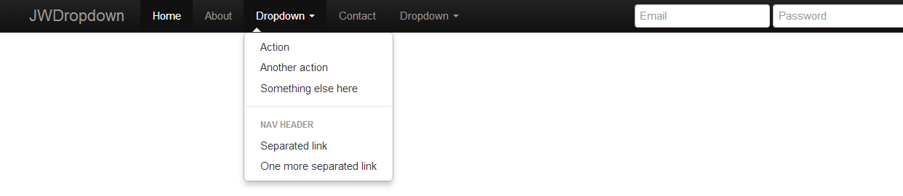

# JwDropdown - Jquery Dropdown Plugin for Bootstrap NavBar

JwDropdown give you option to set NavBar Menu be hover and clickable on specific screen size.
- Filesize just 2Kb(minified version).
- Support Destroy Method - to disable Event
- Support Dynamic Element - clone Object then attach jwdropdown plugin.

Ex: 
Hover on screen > 768px and Click on screen < 768px, 
so you can set Bootstrap NavBar to be clickable on Specific Devices Phone, Tablet or Desktop.

Easy implementations like Bootstrap Dropdown:

`
$(selector).jwdropdown();
`

### [Demo](http://demo.phantasmacode.com/jwdropdown/)
### License: [http://creativecommons.org/licenses/by-nc-sa/3.0/](http://creativecommons.org/licenses/by-nc-sa/3.0/)